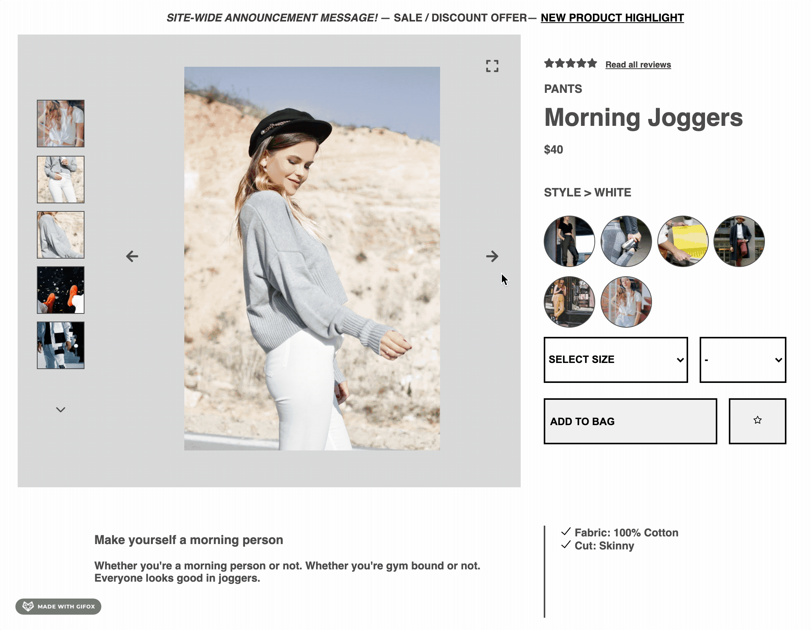
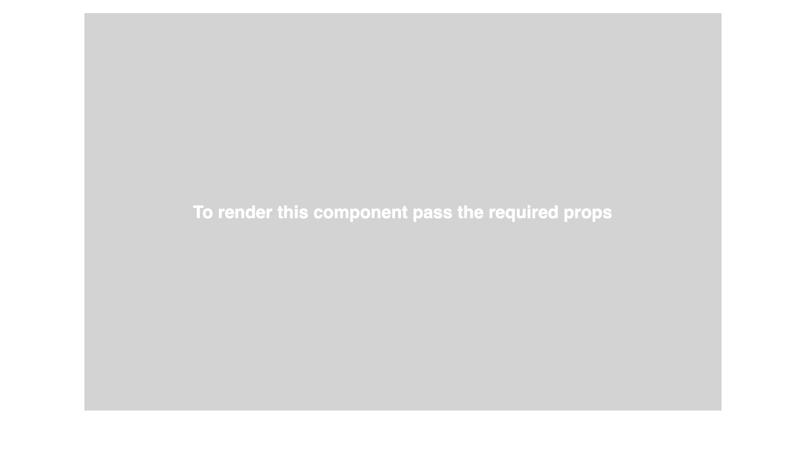

[](https://www.npmjs.com/package/overview-module)

# Overview Module

Overview Module is a React component for HackReactor's Front-end Capstone Project.

## Features

This component renders

- photo gallery
- product information
- style selectors

using data from the external API.



## Installation

```sh
npm install overview-module
```

## Usage

Import Overview into your top level component, render it and pass down the props.



#### Required props

- `apiIP` : String
- `productId` : Number

#### Optional props

- `stars` : a component

#### Example

```javascript
import React from "react";
import Overview from "overview-module";
import Stars from "./components/Stars";

const App = () => {
  return (
    <Overview apiIP={"http://3.21.164.220"} productId={1} stars={<Stars />} />
  );
};
```
